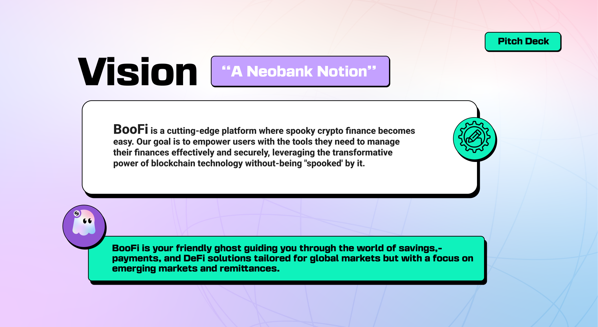

# BooFi: Stablecoin-first Multichain DeFi and Open Banking for Emerging Markets with AI

## 🌐 Overview

BooFi is a cutting-edge platform developed for Wormhole's **Sigma Sprint Hackathon 2024**, designed to bridge the gap between decentralized finance (DeFi) and traditional private banking within the Latin American (LATAM) fintech ecosystem for accessing capital for freelancers and small to medium sized businessed for the future of work. By leveraging a **Hub and Spoke Money Market** model, BooFi facilitates secure borrowing and lending, enabling seamless cross-border transactions and liquidity management across multiple blockchain networks with a private blockchain for open banking services in LATAM looking to create a spoke with the coming of regional CBDCs and stablecoins in the region.

## 🚀 Features

### **Hub and Spoke Money Market**
- **Cross-Chain Integration:** Utilizes **CCIP** and **Wormhole** protocols to transport cryptocurrencies between various blockchains in the (Oracle contract)[https://github.com/tcxcx/boofi-poc/blob/private-blockchain/boofi-lite/contracts/evm/src/contracts/priceOracle/BooFiPriceOracle.sol].
- **Centralized Liquidity Hub:** Aggregates liquidity from multiple L1/L2 blockchains into a central hub, ensuring efficient liquidity management and consensus finalization as per the (Hub contract)[https://github.com/tcxcx/boofi-poc/blob/private-blockchain/boofi-lite/contracts/evm/src/contracts/lendingHub/Hub.sol].
- **Private Blockchain Connectivity:** Connects to a private blockchain or L1 network (**Avalanche**) to provide robust open banking financial services tailored for fintech as per the (Receiver Subnet contract)[https://github.com/tcxcx/boofi-poc/blob/private-blockchain/boofi-lite/contracts/evm/src/contracts/interchain-messaging/ReceiverOnSubnet.sol].
- **Liquidator:** A flash-loan liquidator for over collateralized loan liquidation with AAVE and Uniswap liquidity as per the (Liquidator contract)[https://github.com/tcxcx/boofi-poc/blob/private-blockchain/boofi-lite/contracts/evm/src/contracts/LiquidatorFlashLoan.sol] and the Rust liquidator (bot scavenger)[https://github.com/tcxcx/boofi-poc/blob/private-blockchain/boofi-lite/bots/src/main.rs].

### **Open Banking L1**
- **LATAM Fintech Integration:** A private blockchain designed to connect and support fintech companies across Latin America, currently running locally as it needs 5 valdiators to run with contracts running (Teleporter)[https://github.com/tcxcx/boofi-poc/blob/private-blockchain/boofi-lite/contracts/evm/src/contracts/lendingHub/Hub.sol#L655].
- **CBDC Integration:** Facilitates the incorporation of Central Bank Digital Currencies (CBDCs) from emerging markets, enhancing secure DeFi access.

### **BooFi AI Console**
- **AI-Powered Assistance:** An AI assistant leveraging OpenAI’s Realtime API to manage Coinbase smart wallets and other financial tools as a (Console)[https://github.com/tcxcx/boofi-poc/tree/private-blockchain/boofi-lite/frontend/src/components/blockchain-assistant/boofi-ghost-card] .
- **Real-Time Insights:** Provides users with actionable insights and streamlined wallet management via a Relayer which can connect to the other service providers (Relayer)[https://github.com/tcxcx/boofi-poc/blob/private-blockchain/apps/relay-server/index.js].

### **Payments**
- **ENS-Based Payments:** Supports payments using `base.ens.names` via Wormhole for seamless transactions for (Payments)[https://github.com/tcxcx/boofi-poc/blob/c885a50b1ec3a83652ad6a065a07742292eaf415/boofi-lite/frontend/src/app/%5Blocale%5D/%5Bid%5D/page.tsx#L56].
- **QR Code Art Generator:** Creates visually appealing QR codes for payment links, enhancing user experience via the (useQrCode hook)[https://github.com/tcxcx/boofi-poc/blob/c885a50b1ec3a83652ad6a065a07742292eaf415/boofi-lite/frontend/src/components/framed-qr-art/index.tsx#L12]. Check out the [QR Code Art Generator](https://qrbtf.com/en) to see the potential of this feature.
- **Peanut Protocol Integration:** Enables USDC link payments through the Peanut Protocol for efficient and secure transactions via the (useDeezNuts hooks)[https://github.com/tcxcx/boofi-poc/blob/private-blockchain/boofi-lite/frontend/src/hooks/peanut-protocol/use-create-link.ts].

### **Bridge**
- **USDC Bridging with CCIP:** Ensures smooth and reliable USDC transfers across different blockchain networks using CCIP in the (CCIP Bridge Tab)[https://github.com/tcxcx/boofi-poc/tree/private-blockchain/boofi-lite/frontend/src/components/bridge].

## 🛠 Architecture

### **Technical Stack**
- **Blockchain Protocols:** Avalanche, Base, CCIP, Wormhole
- **AI Integration:** OpenAI Realtime API
- **Frontend:** Next.js 14, TailwindCSS, Shadcn UI components
- **Liquidator:** Rust flash-loan liquidator for over collateralized loan liquidation with AAVE and Uniswap liquidity.
- **AI Voice Relayer:**  AI voice relayer connected to OpenAi's Realtime API for voice assistance.
- **Backend:** Node.js, Supabase
- **Oracles:** Chainlink agreggator and Pyth for weighted decentralized data feeds

## 🔧 Getting Started

### **Prerequisites**
- **Node.js:** Version 20.x or later
- **Package Manager:** bun

## 🧩 Technical Details

### **Hub and Spoke Money Market Model**
BooFi employs a **Hub and Spoke** architecture to manage liquidity and consensus across multiple blockchains:
- **Central Hub:** Acts as the liquidity aggregator and consensus finalizer, deployed on a scalable L1 blockchain.
- **Spokes:** Connect various L1 and L2 blockchains, pulling liquidity into the central hub using CCIP and Wormhole protocols.
- **Private Blockchain Integration:** Links to a dedicated Open Banking L1, enabling secure DeFi access for LATAM fintech and incorporation of CBDCs.

### **BooFi AI Console**
The AI Console enhances user experience through intelligent assistance:
- **Real-Time API Integration:** Utilizes OpenAI’s Realtime API to provide instant insights and management tools.
- **Smart Wallet Management:** Assists users in managing Coinbase smart wallets, offering tailored financial advice and automated transactions.

### **Payments & Bridge**
BooFi’s payment and bridging solutions ensure seamless and secure transactions:
- **ENS-Based Payments:** Simplifies USDC transactions using `base.ens.names` via Wormhole.
- **QR Code Art Generator:** Enhances payment link sharing with customizable QR codes.
- **Peanut Protocol Integration:** Facilitates easy USDC payments through shareable links.
- **CCIP Bridge:** Ensures reliable USDC transfers across different blockchain ecosystems.

## 🙏 Verify our (contract deployments)[https://github.com/tcxcx/boofi-poc/blob/private-blockchain/boofi-lite/contracts/contract-deployments.md] by taking a look at the following document

## 🙏 Acknowledgments

We extend our gratitude to the following organizations and communities for their support and inspiration:

- **[Sigma Hackathon](https://www.sigma-hackathon.com/):** Thank you for organizing an inspiring event that brought together innovative minds to develop groundbreaking projects like BooFi.
- **[Wormhole](https://wormholenetwork.com/):** For facilitating seamless cross-chain cryptocurrency transportation.
- **[Circle](https://www.circle.com/):** For enabling the infrastructure for solving remittances and bringing increased prosperity to all by being able to move money faster, safer with USDC, the digital dollar made for businesses and developers around the world.
- **[CCIP](https://chain.link/ccip):** For their robust cross-chain interoperability protocols.
- **[Midday](https://midday.ai/):** For the foundational monorepo structure ready to scale to multidevice development using a smart microservices turborepo architecture.
- **[Avalanche](https://www.avax.network/):** For providing a scalable and secure blockchain infrastructure for our Open Banking L1.
- **[Peanut Protocol](https://peanutprotocol.com/):** For enabling efficient USDC link payments.
- **[Base](https://base.org/):** For providing a scalable and secure blockchain smart wallet infrastructure and compatible wagmi hooks via onchain kit.
- **[Satoshi Nakamoto](https://bitcoin.org/bitcoin.pdf):** For his gift to mankind and dissapearing.

Special thanks to the contributors and maintainers of the open-source libraries and tools that make BooFi possible.
