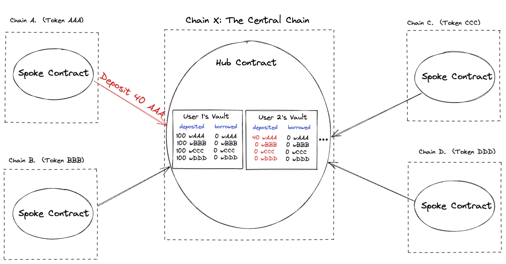

# Guidelines for Coding a Liquidator Bot Using Flashloans for Maximum Efficiency
Create a bot that monitors pending Ethereum transactions and looks for loans that are eligible for liquidation.

We propose a design and reference example (EVM only) for a Cross-chain borrow lend protocol, using a Hub and Spoke model.

Users can deposit assets into the protocol. They can also borrow assets from the protocol, using the assets that they have deposited as collateral. The protocol keeps track of the amount of each asset a user has deposited, and the amount of each asset a user has borrowed. We will often refer to a user’s deposited and borrowed assets in the protocol as their ‘vault’.

Users can also repay assets (returning some or all of their borrowed assets) and withdraw assets (retaking some or all of their deposited assets).

An array of liquidator accounts can also liquidate other users if the other user’s borrowed assets are worth less than their deposited assets. We use Pyth prices to determine value of assets.

We store all state on the Hub chain, and have a Spoke contract deployed on each spoke chain, so that users on any chain can perform the deposit, borrow, withdraw, and repay actions through the corresponding Spoke contract.




In this guide, we will provide comprehensive steps and best practices to code a highly efficient liquidator bot that leverages flashloans for performing liquidations in DeFi protocols. This guide incorporates insights from the paper **"Liquidations: DeFi on a Knife-edge"** by Daniel Perez et al. 2021, and builds upon the provided `LiquidatorFlashLoan` and `Liquidator` contracts.


## Table of Contents

1. [Understanding Liquidations and Flashloans](#1-understanding-liquidations-and-flashloans)
2. [Key Insights from the Paper](#2-key-insights-from-the-paper)
3. [Designing the Liquidator Bot](#3-designing-the-liquidator-bot)
4. [Implementing Real-Time Monitoring](#4-implementing-real-time-monitoring)
5. [Integrating with Flashloan Contracts](#5-integrating-with-flashloan-contracts)
6. [Optimizing Transaction Submission](#6-optimizing-transaction-submission)
7. [Handling Price Feeds and Oracles](#7-handling-price-feeds-and-oracles)
8. [Mitigating Miner Extractable Value (MEV)](#8-mitigating-miner-extractable-value-mev)
9. [Security Considerations](#9-security-considerations)
10. [Testing and Deployment](#10-testing-and-deployment)
11. [Summary](#11-summary)

---

## 1. Understanding Liquidations and Flashloans

### Liquidations in DeFi

In decentralized finance (DeFi), borrowers must provide collateral that exceeds the value of their loans to protect lenders from default risk due to the pseudonymous nature of blockchain addresses. When the value of the collateral falls below a certain threshold (the liquidation threshold), the position becomes **undercollateralized** and is eligible for liquidation. Liquidators can repay part or all of the debt on behalf of the borrower and, in return, receive a portion of the collateral at a discount.

### Flashloans

A **flashloan** is an uncollateralized loan where borrowing and repayment occur within a single blockchain transaction. Flashloans enable users to access large amounts of capital without upfront collateral, provided the loan is repaid before the transaction ends. This feature is particularly useful for liquidators who may not have sufficient capital to perform large liquidations.

---

## 2. Key Insights from the Paper

The paper **"Liquidations: DeFi on a Knife-edge"** provides several insights that are crucial for designing an efficient liquidator bot:

- **Efficiency of Liquidators**: Over 70% of liquidations occur within the same block as the position becomes liquidatable. Speed is critical.

- **Monitoring**: Effective monitoring of borrowers' collateralization ratios is essential to identify liquidation opportunities promptly.

- **Gas Optimization**: Minimizing gas usage and optimizing transaction fees can increase the likelihood of transaction inclusion in the next block.

- **MEV Risks**: Miners can extract value by front-running liquidation transactions. Mitigating MEV is important to protect profits.

- **Price Volatility**: Even small price movements (e.g., 3%) can result in significant liquidation opportunities.

---

## 3. Designing the Liquidator Bot

To build a highly efficient liquidator bot, we need to address the following components:

1. **Real-Time Monitoring**: Continuously monitor the DeFi protocol for undercollateralized positions.

2. **Flashloan Integration**: Use flashloans to obtain capital for liquidation without upfront funds.

3. **Optimized Transaction Submission**: Ensure transactions are submitted quickly and included in the next block.

4. **Price Feed Handling**: Use accurate and timely price data to determine liquidation eligibility.

5. **MEV Mitigation**: Protect against front-running and sandwich attacks by miners or bots.

6. **Gas Price Management**: Dynamically adjust gas prices to balance cost and transaction speed.

---

## 4. Implementing Real-Time Monitoring

### 4.1 Monitoring Collateralization Ratios

To identify liquidation opportunities, the bot must monitor the collateralization ratios of all borrowers in real-time.

**Approach**:

- **Fetch Borrower Data**: Use the protocol's subgraph or APIs to retrieve the list of all borrowers and their positions.

- **Calculate Ratios**: For each borrower, calculate the current collateralization ratio using the latest price data.

- **Identify Liquidatable Positions**: Determine which positions have fallen below the liquidation threshold.

**Implementation Tips**:

- **Efficient Data Retrieval**: Use WebSocket connections or subscription services to receive updates instead of polling.

- **Batch Processing**: Process multiple borrowers in parallel to reduce latency.

- **Prioritize High-Value Positions**: Focus on positions that offer the highest profit potential.

### 4.2 Monitoring Price Feeds

- **Subscribe to Price Oracles**: Listen to events from price oracles (e.g., Chainlink) to get immediate updates on price changes.

- **Handle Price Volatility**: Implement thresholds to trigger recalculations when prices change significantly.

---

## 5. Integrating with Flashloan Contracts

The provided `LiquidatorFlashLoan` contract is designed to perform liquidations using flashloans. The bot should interact with this contract to execute liquidations.

### 5.1 Understanding the Contract Structure

- **`LiquidatorFlashLoan.sol`**: Extends the `Liquidator` contract to perform liquidations using Aave's flashloans.

- **Key Functions**:
  - `liquidation()`: Initiates the liquidation process.
  - `executeOperation()`: Called by Aave after the flashloan is granted, where the actual liquidation logic resides.

### 5.2 Implementing the Liquidation Logic

**Steps**:

1. **Initiate Flashloan**: Call the `liquidation()` function with the liquidation parameters.

2. **Handle Flashloan Callback**: In `executeOperation()`, perform the liquidation using the borrowed funds.

3. **Swap Collateral**: Exchange the received collateral for the borrowed asset to repay the flashloan.

4. **Profit Calculation**: Any remaining assets after repaying the loan are profit.

**Implementation Tips**:

- **Approve Tokens**: Ensure that the contract approves the necessary tokens for transfers.

- **Slippage Control**: Use price oracles to set minimum amounts during swaps to prevent losses due to slippage.

- **Reentrancy Guards**: Implement security measures to prevent reentrancy attacks.

---

## 6. Optimizing Transaction Submission

### 6.1 Minimizing Latency

- **Immediate Transaction Submission**: Submit the transaction as soon as a liquidation opportunity is identified.

- **Parallelization**: Run multiple instances of the bot to handle multiple opportunities simultaneously.

### 6.2 Gas Price Strategy

- **Dynamic Gas Pricing**: Implement algorithms to adjust gas prices based on network conditions.

- **Gas Price Estimators**: Use services like Etherscan Gas Tracker or GasNow API to get current gas prices.

### 6.3 Transaction Pool Management

- **Nonce Management**: Handle transaction nonces correctly to avoid transaction replacement issues.

- **Transaction Replacement**: If a transaction is pending for too long, consider replacing it with a higher gas price.

---

## 7. Handling Price Feeds and Oracles

### 7.1 Ensuring Accurate Prices

- **Use Reliable Oracles**: Integrate with trusted price oracles like Chainlink or Pyth.

- **Fallback Mechanisms**: Implement fallback oracles in case the primary oracle fails.

### 7.2 Dealing with Oracle Latency

- **Timestamp Verification**: Check the timestamp of price data to ensure it's recent.

- **Max Price Age**: Define a maximum acceptable age for price data to prevent using stale information.

---

## 8. Mitigating Miner Extractable Value (MEV)

### 8.1 Understanding MEV Risks

- **Front-Running**: Miners or bots may detect your pending transaction and submit their own to capture the profit.

- **Sandwich Attacks**: Surrounding a transaction with buy and sell orders to manipulate prices.

### 8.2 Mitigation Strategies

- **Private Transactions**: Use private transaction relays like [Flashbots](https://flashbots.net/) to prevent transactions from appearing in the public mempool.

- **Transaction Encryption**: Encrypt transaction data to prevent it from being read before inclusion in a block.

- **Gas Price Management**: Set competitive gas prices to reduce the chance of being outbid.

### 8.3 Using Flashbots

- **Integration**: Modify the bot to send transactions via Flashbots RPC.

- **Bundle Transactions**: Create transaction bundles that include both the liquidation and the flashloan repayment.

- **Simulation**: Use Flashbots' simulation tools to test transactions before submission.

---

## 9. Security Considerations

### 9.1 Smart Contract Security

- **Auditing**: Ensure that the `LiquidatorFlashLoan` contract is audited by reputable firms.

- **Upgrades and Patches**: Keep the contract updated with the latest security patches.

### 9.2 Bot Security

- **Private Key Management**: Securely store the bot's private keys using hardware security modules (HSM) or secure enclaves.

- **Access Controls**: Limit access to the bot's environment to authorized personnel only.

### 9.3 Error Handling

- **Transaction Failures**: Implement retry mechanisms for failed transactions.

- **Exception Handling**: Ensure that the bot handles exceptions gracefully without crashing.

---

## 10. Testing and Deployment

### 10.1 Testing Strategies

- **Unit Tests**: Write comprehensive unit tests for all functions in the bot.

- **Integration Tests**: Test the bot end-to-end on a testnet (e.g., Kovan, Ropsten) using mock protocols.

- **Simulation**: Use tools like Ganache or Hardhat to simulate blockchain environments.

### 10.2 Deployment

- **Infrastructure**: Deploy the bot on a reliable server with low latency to Ethereum nodes.

- **Monitoring**: Implement monitoring tools to track the bot's performance and detect issues.

- **Logging**: Keep detailed logs for troubleshooting and auditing purposes.

---

## 11. Summary

By following these guidelines, you can develop a liquidator bot that leverages flashloans to perform liquidations efficiently and profitably. The key is to combine real-time monitoring, rapid transaction submission, and MEV mitigation strategies to stay ahead in the competitive liquidation market.

---

# Detailed Implementation Steps

Below are more detailed steps and code snippets to help you implement the liquidator bot effectively.

## Step 1: Set Up the Development Environment

- **Languages and Frameworks**: Use a language like **TypeScript** or **Python** for the bot, and **Solidity** for smart contracts.

- **Libraries**:
  - **Web3.js** or **Ethers.js** for blockchain interactions.
  - **OpenZeppelin Contracts** for standard contract interfaces.
  - **Aave Protocol** SDK for flashloan interactions.

- **Tools**:
  - **Hardhat** or **Truffle** for smart contract development and testing.
  - **Ganache** for local blockchain testing.
  - **Infura** or **Alchemy** for Ethereum node access.

## Step 2: Implement Real-Time Monitoring

### 2.1 Fetching Borrower Data

```typescript
import { ethers } from 'ethers';
import { Compound } from '@compound-finance/compound-js';

// Initialize Compound
const compound = new Compound('mainnet', { privateKey: 'YOUR_PRIVATE_KEY' });

// Fetch all borrowers
async function getAllBorrowers() {
  const accounts = await compound.getAccounts();
  return accounts.filter(account => account.total_borrow_value_in_eth > 0);
}
```

### 2.2 Calculating Collateralization Ratios

```typescript
async function calculateCollateralization(account) {
  const collateralValue = account.total_collateral_value_in_eth;
  const borrowValue = account.total_borrow_value_in_eth;
  const collateralRatio = (collateralValue / borrowValue) * 100;
  return collateralRatio;
}
```

### 2.3 Identifying Liquidatable Positions

```typescript
const LIQUIDATION_THRESHOLD = 100; // Adjust based on protocol

async function findLiquidatablePositions() {
  const borrowers = await getAllBorrowers();
  const liquidatable = [];
  for (const borrower of borrowers) {
    const ratio = await calculateCollateralization(borrower);
    if (ratio < LIQUIDATION_THRESHOLD) {
      liquidatable.push(borrower);
    }
  }
  return liquidatable;
}
```

## Step 3: Integrate with Flashloan Contracts

### 3.1 Interacting with `LiquidatorFlashLoan` Contract

```typescript
const liquidatorContractAddress = 'YOUR_LIQUIDATOR_FLASHLOAN_CONTRACT_ADDRESS';
const liquidatorAbi = [/* ABI of LiquidatorFlashLoan */];

const liquidatorContract = new ethers.Contract(liquidatorContractAddress, liquidatorAbi, signer);

async function initiateLiquidation(borrowerAddress, repayAsset, repayAmount, collateralAsset) {
  const liquidationInput = {
    borrower: borrowerAddress,
    assets: [
      {
        assetAddress: repayAsset,
        repaidAmount: repayAmount,
        depositTakeover: false,
      },
    ],
  };

  const tx = await liquidatorContract.liquidation(liquidationInput);
  await tx.wait();
}
```

## Step 4: Optimize Transaction Submission

### 4.1 Dynamic Gas Pricing

```typescript
async function getGasPrice() {
  const gasPrice = await provider.getGasPrice();
  // Optionally, add a multiplier
  return gasPrice.mul(ethers.BigNumber.from('110')).div(ethers.BigNumber.from('100')); // Increase by 10%
}
```

### 4.2 Submitting Transactions Quickly

```typescript
async function submitLiquidationTransaction(liquidationParams) {
  const gasPrice = await getGasPrice();
  const tx = await liquidatorContract.liquidation(liquidationParams, {
    gasPrice: gasPrice,
    gasLimit: ethers.utils.hexlify(500000), // Adjust gas limit
  });
  await tx.wait();
}
```

## Step 5: Mitigate MEV Risks

### 5.1 Using Flashbots

**Prerequisites**:

- Install the Flashbots SDK.

**Implementation**:

```typescript
import { FlashbotsBundleProvider } from '@flashbots/ethers-provider-bundle';

async function submitViaFlashbots(tx) {
  const flashbotsProvider = await FlashbotsBundleProvider.create(
    provider,
    signer,
    'https://relay.flashbots.net/',
    'mainnet',
  );

  const signedTransactions = await flashbotsProvider.signBundle([
    {
      signer: signer,
      transaction: tx,
    },
  ]);

  const bundleResponse = await flashbotsProvider.sendRawBundle(
    signedTransactions,
    ethers.provider.getBlockNumber() + 1,
  );

  if ('error' in bundleResponse) {
    console.error(bundleResponse.error.message);
    return;
  }

  const bundleResolution = await bundleResponse.wait();
  if (bundleResolution === 0) {
    console.log('Bundle included in block');
  } else {
    console.log('Bundle not included');
  }
}
```

## Step 6: Handle Price Feeds

### 6.1 Integrate with Chainlink Oracles

```typescript
const aggregatorV3InterfaceABI = [
  {
    inputs: [],
    name: 'latestRoundData',
    outputs: [
      { name: 'roundId', type: 'uint80' },
      { name: 'answer', type: 'int256' },
      { name: 'startedAt', type: 'uint256' },
      { name: 'updatedAt', type: 'uint256' },
      { name: 'answeredInRound', type: 'uint80' },
    ],
    stateMutability: 'view',
    type: 'function',
  },
];

async function getLatestPrice(oracleAddress) {
  const priceFeed = new ethers.Contract(oracleAddress, aggregatorV3InterfaceABI, provider);
  const roundData = await priceFeed.latestRoundData();
  const price = roundData.answer;
  const updatedAt = roundData.updatedAt;
  return { price, updatedAt };
}
```

---

# Conclusion

Developing an efficient liquidator bot requires careful consideration of various factors, including real-time monitoring, flashloan integration, transaction optimization, price feed accuracy, MEV mitigation, and security. By following the guidelines provided and leveraging the insights from the paper, you can build a robust bot that maximizes liquidation opportunities while minimizing risks.

Remember to thoroughly test your bot in a safe environment before deploying it on the mainnet. Stay updated with the latest developments in DeFi protocols and adjust your strategies accordingly.

**Disclaimer**: Liquidations involve financial risk and require a deep understanding of DeFi protocols. Ensure compliance with all relevant laws and regulations.

# Other Literature & Links
[How to Build a Compound Liquidation Bot](https://blog.baowebdev.com/2019/11/how-to-build-a-compound-liquidation-bot/)
[Boron - Compound Liquidator Bot](https://github.com/l3a0/boron)
[Compound Liquidator](https://github.com/conlan/compound-liquidator)
[Morpho Liquidation Flash](https://github.com/morpho-labs/morpho-liquidation-flash/tree/main)
[Exactly Liquidation Bot](https://github.com/exactly/liquidation-bot)
---